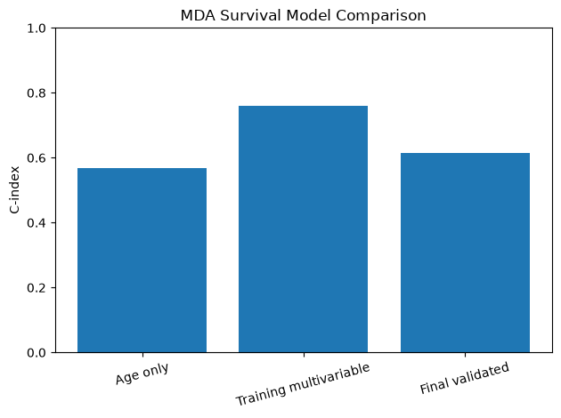

# Real MDA Survival Analysis

## Dataset

- Dataset: MDA clinical data
- Patients: 156
- Outcome: Overall survival
- Validation: 5-fold cross-validation

## Features

- Age
- Sex
- HPV status

## Result

- Mean cross-validated C-index: 0.615

## Interpretation

The model achieved a mean C-index of approximately 0.615.

This indicates modest predictive performance using only three clinical variables.

The result is more reliable than the training C-index because it was evaluated using 5-fold cross-validation.

## Limitation

This dataset appears to represent a single centre (MDA), so it cannot be used for true centre-aware validation.

Centre-aware validation is currently demonstrated using the synthetic multi-centre pipeline.
## Model comparison

The training multivariable model achieved the highest apparent C-index, but this value was measured on the training data and is therefore optimistic.

The final validated model achieved a mean 5-fold cross-validated C-index of approximately 0.615.

